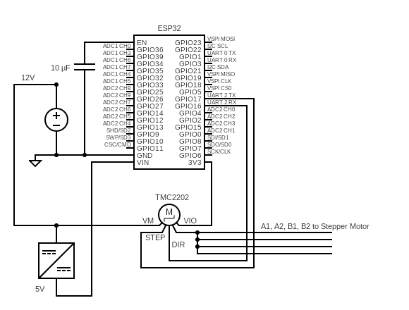
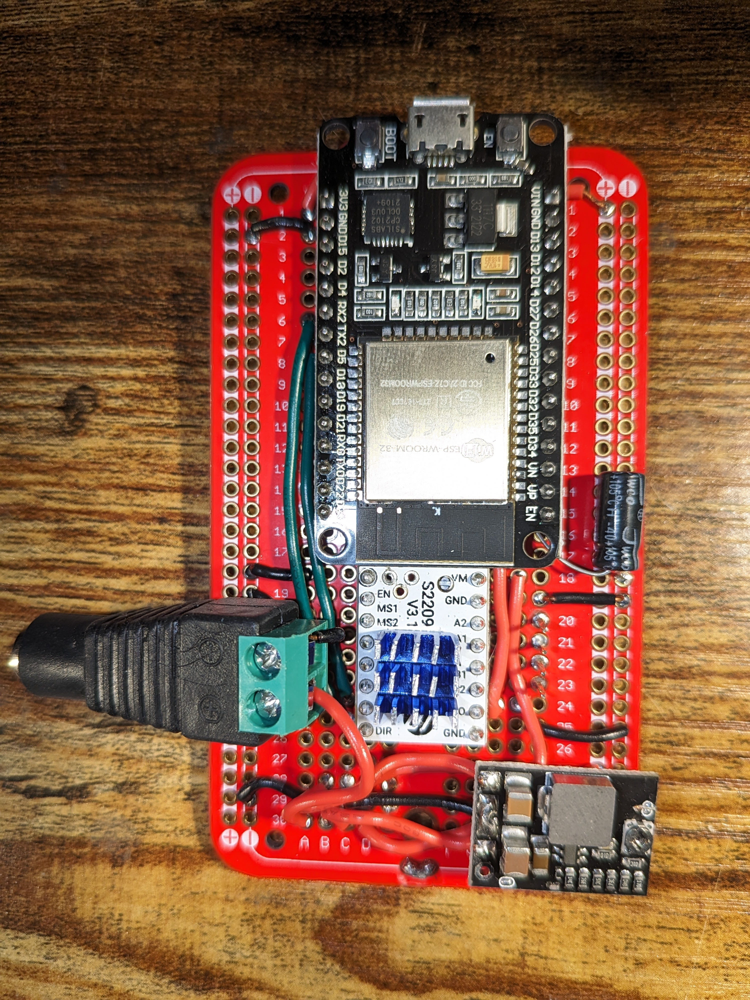
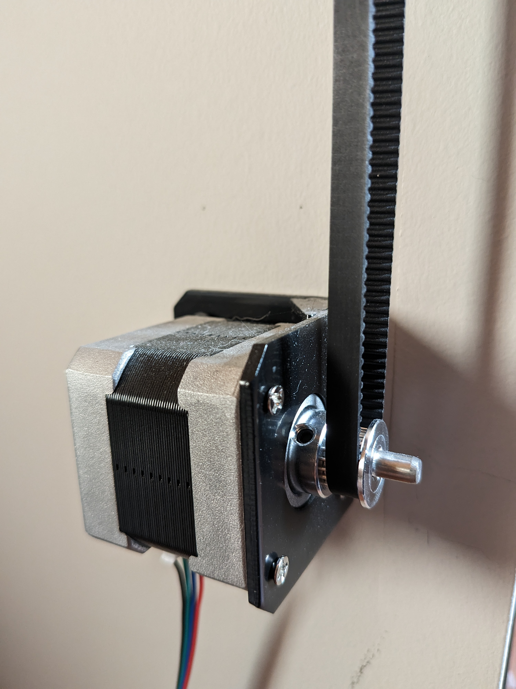
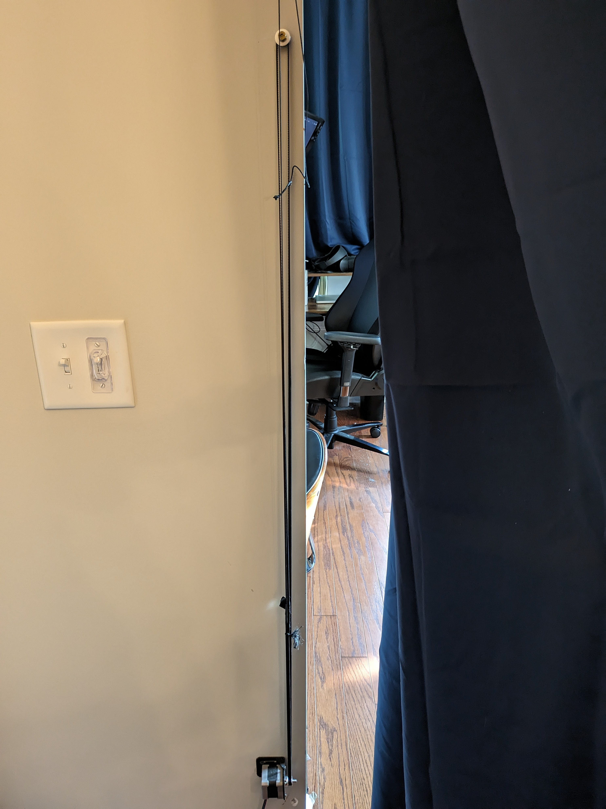

# ESPHome Smart Curtains

<video controls>
	<source src="SmartCurtainsInAction.mp4" type="video/mp4">
</video>

Using an ESP32, a stepper motor and driver, ESPHome, and Home Assistant, I created a set of completely do it yourself smart curtains. This was based on existing smart curtain projects such as those done by DIY Machines on YouTube. This DIY method proved to be much less expensive than commercial options for smart curtains, which range from $90 - $250.

These curtains are one of my favorite DIY projects as there are very few good commercial alternatives and are so convenient:

-   Opens automatically in the morning.
-   Closes at night when I go to sleep.
-   Closes when I turn on home theater mode in my living room.

## Prerequisite Software

This project uses [ESPHome](https://esphome.io/index.html) hosted on [Home Assistant](https://www.home-assistant.io/). I highly recommend both for controlling your smart home and DIY projects. Home Assistant gives you full local control over your smart devices, and ESPHome makes creating DIY smart devices super easy.

## Parts and Tools

While you don't have to use these exact parts, these are the ones I used:

-   [NEMA 17 Stepper Motors](https://www.amazon.com/gp/product/B0B38H2ZMR/)
-   [Stepper Motor Mounting Brackets](https://www.amazon.com/gp/product/B092ZSF899/)
-   [TMC2209 Stepper Motor Drivers](https://www.amazon.com/gp/product/B08M9J8SB7/)
-   [GT2 Timing Belt Kit](https://www.amazon.com/gp/product/B08SMFM3Z6/)
-   [ESP32 Development Boards](https://www.amazon.com/gp/product/B086MGH7JV/) - any that is compatible with ESPHome should work, this listing says ESP-WROOM-32 but they're actually copies of the DOIT ESP32 DevKit V1
-   [Breadboards](https://www.amazon.com/gp/product/B07LFD4LT6/) - for prototyping
-   [Protoboards](https://www.amazon.com/gp/product/B07ZYPCXZ3) - for the finished circuit
-   [Project Boxes](https://www.amazon.com/gp/product/B07G8S6XLV/) - for protecting the finished circuit
-   [Power Supplies](https://www.amazon.com/gp/product/B086JLYBQ7) - the stepper motors I used require at least 12V and 1.5A
-   [DC to DC Buck Converters](https://www.amazon.com/gp/product/B08Q3TKJH5/) - much better and safer than voltage regulators
-   [Various](https://www.amazon.com/gp/product/B07PBQXQNQ/) [Capacitors](https://www.amazon.com/gp/product/B07117K2ND/) - either should work
-   [Blackout Curtains](https://www.amazon.com/gp/product/B07RZBRQDQ/) - grommets allow it to easily slide along the curtain rod
-   [Curtain Rods](https://www.amazon.com/gp/product/B07D5CMLF7/)
-   [Kevlar Cord](https://www.amazon.com/gp/product/B082VWRZXP/) - the stronger the better here
-   [Super Glue](https://www.amazon.com/gp/product/B000LGPD64/)
-   [Spools](https://www.amazon.com/gp/product/B08GJ1PP9T/) - to wind the kevlar line around, I haven't switched to these yet but plan to the next time my kevlar line breaks
-   [Soldering iron](https://www.amazon.com/gp/product/B07RZV2DW8/) - I like this one since it is grounded and affordable
-   [Wire](https://www.amazon.com/gp/product/B08BBXTBL7/)
-   [Screws](https://www.lowes.com/pd/Fas-n-Tite-8-x-3-in-Bugle-Coarse-Thread-Drywall-Screws-1-lb/999996464) - for stud mounting everything
-   A drill or impact driver
-   Screw driver
-   Stud finder

## Circuit Diagram

The capacitor from the `EN` pin to ground is to prevent a hardware bug that causes some ESP32 devkit variants to not boot when powered via `VIN`

Note: the DC to DC buck convert and stepper motor driver also have to be grounded.

## Completed Circuit

The completed circuit was placed in a project box with a hole cut out for the power plug and stepper motor cable.

## Installing The Motor

The stepper motor was installed directly underneath where the curtain rod was mounted, such that it can be hidden by the curtain and be close to a power outlet for the circuit.

WARNING: do not manually actuate the motor when it is plugged into the circuit unpowered. This will turn it into a generator which can fry the circuit, speaking from experience.

I chose to mount the GT2 timing belt vertically underneath the curtain rod mount so that it would also be hidden by the curtain. The top terminates in another screw with a pulley bearing so that it can rotate freely with reduced friction.
The timing belt track needs to be long enough so that the curtains strings can be attached to either side of it and fully open and close the curtains, and the attachment point of the strings does not go around the top or bottom of the track.

For wiring the curtains, I went with a similar method to that done by [DIY Machines on YouTube Here](https://www.youtube.com/watch?v=JtYdPwO65WI&t=795s). The gist being that one line opens both curtains, while the other closes both curtains. These strings are attached to either side of the GT2 timing belt such that when the stepper motor is rotating in one direction it pulls the opening line while the closing line is slack, and vice versa when the stepper motor is rotating in the opposite direction. I attached the kevlar lines to the timing belt and curtains by tying several simple overhand knots in place and sealing them with super glue.
